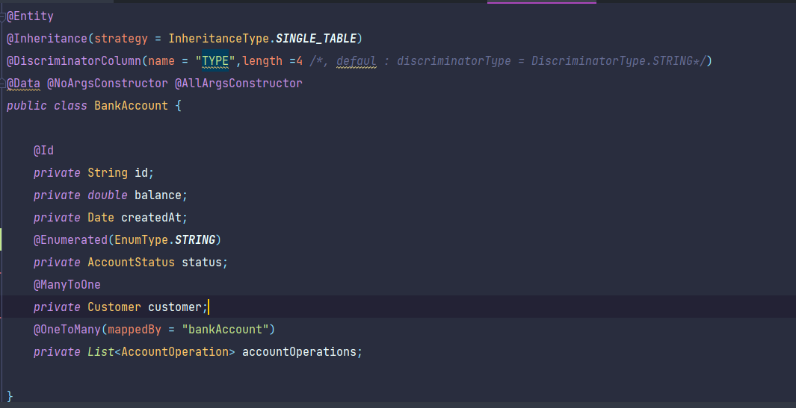
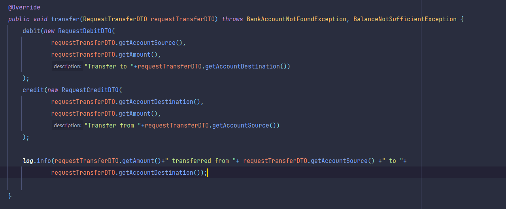

# Backend Degital Banking 

### diagramme de classe :

### création des entities :
package :(`src/main/java/com/digitalbancking/digitalbancking/entities`)
    
    info :
    - dans l'héritage on utilise la stratégie : Single table

1. BankAccount : 

2. SavingAccount :

3. CurrentAccount :

4. AccountOperation :

5. Customer :

### création des enums :
package :(`src/main/java/com/digitalbancking/digitalbancking/enums`)

1. AccountStatus :

2. OperationType :

### création des repositories :
package :(`src/main/java/com/digitalbancking/digitalbancking/repositories`)

1. AccountOperationRepository :

2. BankAccountRepository :

3. CustomerRepository :

#### tester les repositories:
- modifier le fichier : application.properties :

- ajouter des données (fonction : commandLineRunnerForTestRepositories): (`src/main/java/com/digitalbancking/digitalbancking/DigitalBanckingApplication.java`)
  - customers:
    
    

  - accounts :
    
    

  - operations :
    
    

### création des Services :
package :(`src/main/java/com/digitalbancking/digitalbancking/services`)

1. création de l'interface bankAccountService et leur implementation (`src/main/java/com/digitalbancking/digitalbancking/services/BankAccountServiceImpl.java`) :

    
    
  - fonction saveCustomer :

    

  - fonction saveCurrentBankAccount :

    

  - fonction saveSavingBankAccount :

    

  - fonction listCustomers :

    

  - fonction listBankAccount :

    

  - fonction getBankAccount :

    

  - fonction debit :

    

  - fonction credit :

    

  - fonction transfer :

    

### création des Exceptions :
package :(`src/main/java/com/digitalbancking/digitalbancking/services`)

  - BalanceNotSufficientException

    

  - BankAccountNotFoundException

    

  - CustomerNotFoundException

    

### tester les Services :

- ajouter des données (fonction : commandLineRunnerForTestServices) : (`src/main/java/com/digitalbancking/digitalbancking/DigitalBanckingApplication.java`)

  

