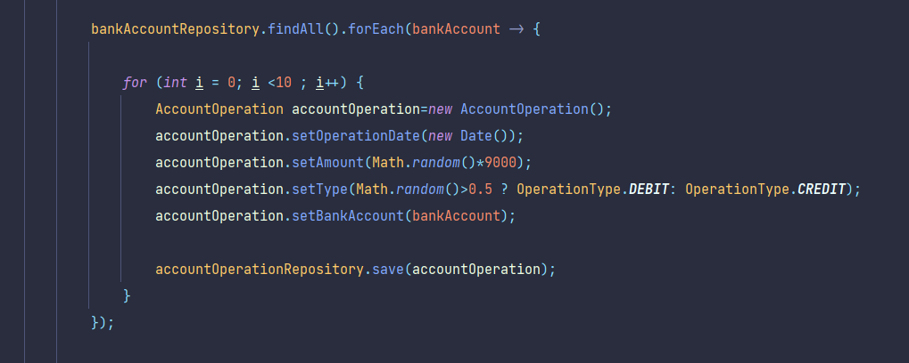

# Backend Degital Banking 

### diagramme de classe :

### création des entities :
package :(`src/main/java/com/digitalbancking/digitalbancking/entities`)
    
    info :
    - dans l'héritage on utilise la stratégie : Single table

1. BankAccount : 

2. SavingAccount :

3. CurrentAccount :

4. AccountOperation :

5. Customer :

### création des enums :
package :(`src/main/java/com/digitalbancking/digitalbancking/enums`)

1. AccountStatus :

2. OperationType :

### création des repositories :
package :(`src/main/java/com/digitalbancking/digitalbancking/repositories`)

1. AccountOperationRepository :

2. BankAccountRepository :

3. CustomerRepository :

#### tester les repositories:
- modifier le fichier : application.properties :

- ajouter les données : (`src/main/java/com/digitalbancking/digitalbancking/DigitalBanckingApplication.java`)
  - customers:
    
    

  - accounts :
    
    

  - operations :
    
    

