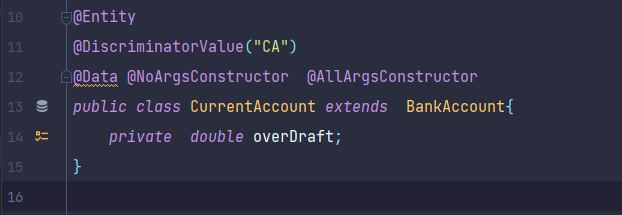
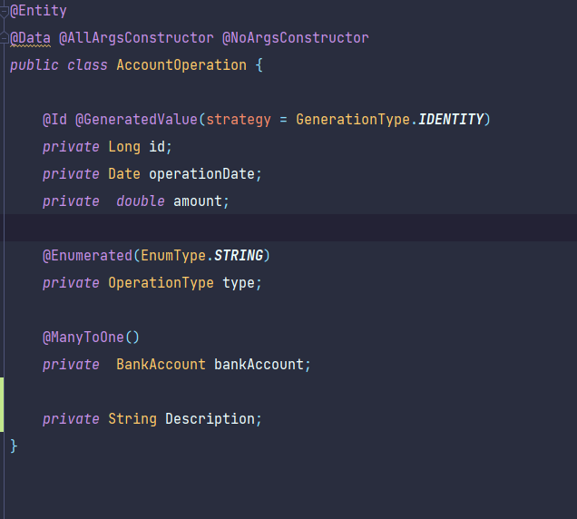
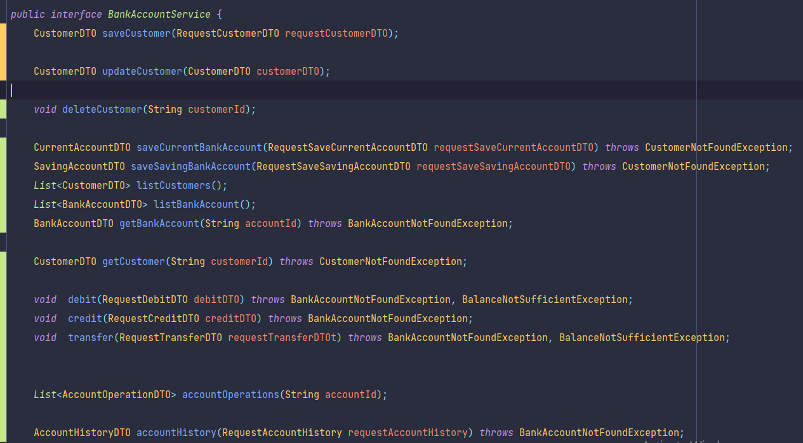
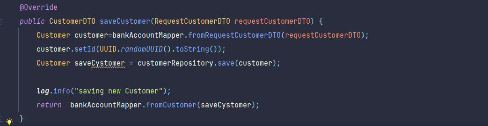
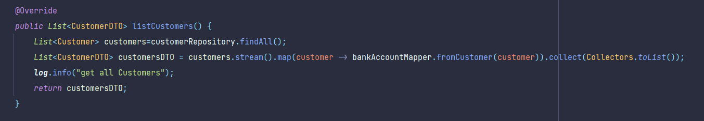
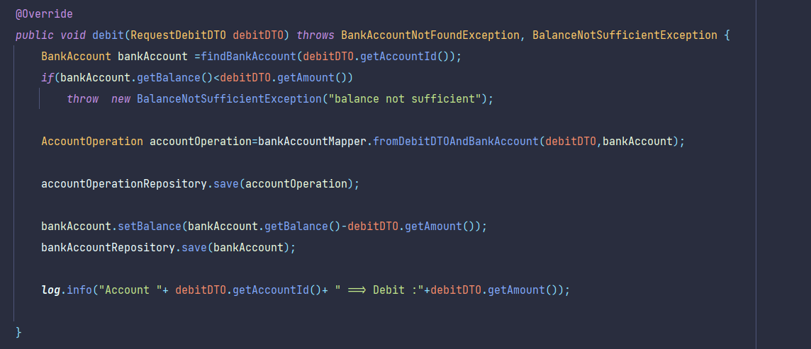
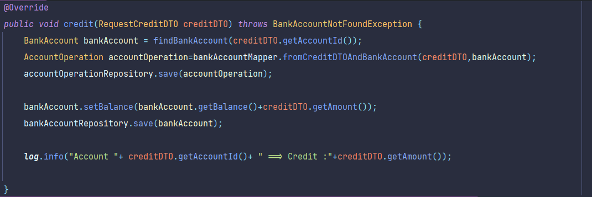

# Backend Degital Banking 

### diagramme de classe :

### création des entities :
package :(`src/main/java/com/digitalbancking/digitalbancking/entities`)
    
    info :
    - dans l'héritage on utilise la stratégie : Single table

1. BankAccount : 

2. SavingAccount :

3. CurrentAccount :

4. AccountOperation :

5. Customer :

### création des enums :
package :(`src/main/java/com/digitalbancking/digitalbancking/enums`)

1. AccountStatus :

2. OperationType :

### création des repositories :
package :(`src/main/java/com/digitalbancking/digitalbancking/repositories`)

1. AccountOperationRepository :

2. BankAccountRepository :

3. CustomerRepository :

#### tester les repositories:
- modifier le fichier : application.properties :

- ajouter des données (fonction : commandLineRunnerForTestRepositories): (`src/main/java/com/digitalbancking/digitalbancking/DigitalBanckingApplication.java`)
  - customers:
    
    

  - accounts :
    
    

  - operations :
    
    

### création des classes DTO :
package :(`src/main/java/com/digitalbancking/digitalbancking/dtos`)

  - AccountHistoryDTO :

    

  - AccountOperationDTO :

    

  - BankAccountDTO :

    

  - CurrentAccountDTO :

    

  - CustomerDTO :

    

  - RequestAccountHistory :

    

  - RequestCreditDTO :

    

  - RequestCustomerDTO :

    

  - RequestDebitDTO :

    

  - RequestSaveCurrentAccountDTO :

    

  - RequestSaveSavingAccountDTO :

    

  - RequestTransferDTO :

    

  - SavingAccountDTO :

    

### création des mappers :

1. création de  l'interface BankAccountMapper et leur implementation (`src/main/java/com/digitalbancking/digitalbancking/mappers/BankAccountMapperImpl.java`)

   

  - fonction fromCustomer :

  
   
  - fonction fromCustomerDTO :

    

   - fonction fromRequestCustomerDTO :

     

   - fonction fromCurrentAccount :

     

   - fonction fromCurrentAccountDTO :

     

   - fonction fromSavingAccount :

     

   - fonction fromSavingAccountDTO :

     

   - fonction fromAccountOperation :

     

   - fonction fromAccountOperationDTO :

     

   - fonction fromRequestCurrentAccountDTOAndCustomer :

     

   - fonction fromRequestSavingAccountDTOAndCustomer :

     

   - fonction fromDebitDTOAndBankAccount :

     

   - fonction fromCreditDTOAndBankAccount :

     

   - fonction toAccountHistoryDTO :

     

### création des Services :
package :(`src/main/java/com/digitalbancking/digitalbancking/services`)

1. création de l'interface bankAccountService et leur implementation (`src/main/java/com/digitalbancking/digitalbancking/services/BankAccountServiceImpl.java`) :

    
    
  - fonction saveCustomer :
  
    

  - fonction updateCustomer :

    

  - fonction deleteCustomer :

    

  - fonction getCustomer :
    
    

  - fonction saveCurrentBankAccount :

    

  - fonction saveSavingBankAccount :

    

  - fonction listCustomers :

    

  - fonction listBankAccount :

    

  - fonction getBankAccount :

    

  - fonction debit :

    

  - fonction credit :

    

  - fonction transfer :

    

  - fonction accountOperations :

    

  - fonction accountHistory :
    
    

### création des Exceptions :
package :(`src/main/java/com/digitalbancking/digitalbancking/services`)

  - BalanceNotSufficientException

    

  - BankAccountNotFoundException

    

  - CustomerNotFoundException

    

### tester les Services :

- ajouter des données (fonction : commandLineRunnerForTestServices) : (`src/main/java/com/digitalbancking/digitalbancking/DigitalBanckingApplication.java`)

  

### création des RestController:

  - BankAccountRestController :

    
    

  - CustomerRestController :

    

#### test  par l'utilisation de `swagger ui`:

 - tout les clients :

   

 - ajouter un client :

   

 - consulter un client :

   

 - modifier un client :

   

 - delete un client :

   

 - consulter tous les comptes :

   

 - consulter un compte :

   

 - tout les opérations d'un compte :

   

 - historique de compte avec la pagination :

   

 - création de compte Saving :

   

 - création de compte Current :

   

 - effectuer un crédit :

   

 - effectuer un débit :

   

 - effectuer un virement :

   

